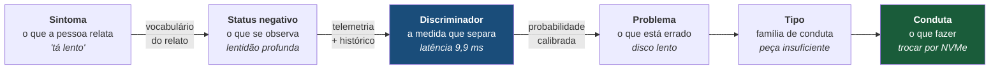
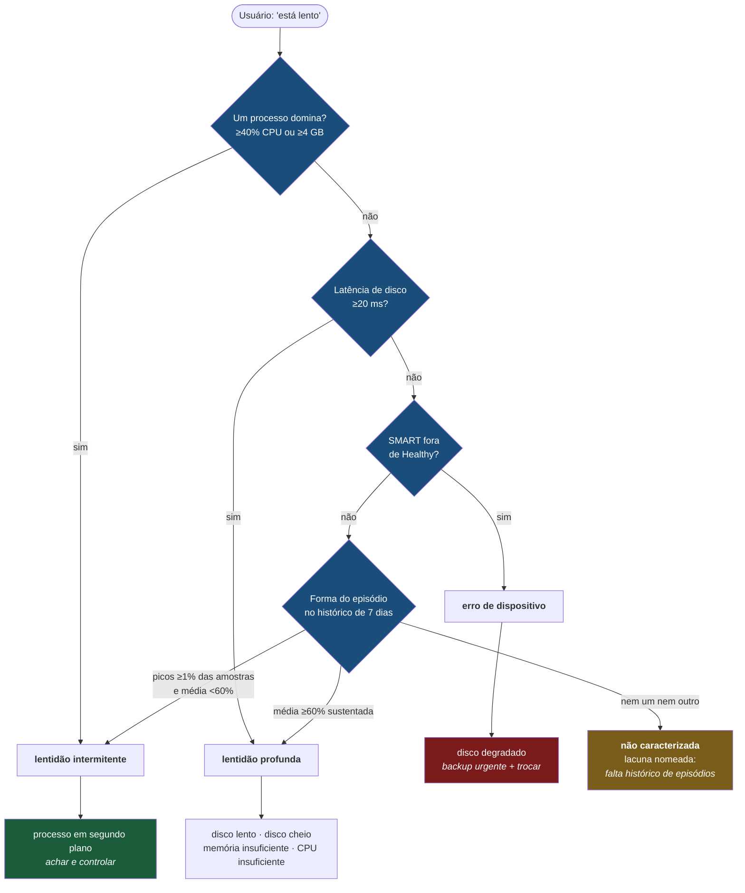

# Mapa do diagnóstico TGDesk

Três recortes do mesmo modelo, do dado que está em produção hoje: 9 status
observáveis, 22 problemas, 73 ligações.

---

## 1. A cadeia inteira

O que o usuário percebe é **sintoma**. O que está errado é **problema**. Entre
os dois existe uma medida — e é ela que faz a diferença entre diagnóstico e
palpite.

**Sem o passo do meio, o produto adivinha.** É por isso que causa sem
discriminador medido entra no catálogo marcada como lacuna, em vez de sumir.

---

## 2. O caminho real da lentidão

Este é o código que roda hoje, com os limiares que estão em produção. Cada
losango é uma medida, não uma opinião.

**Onde cada máquina do parque cai hoje:**

| Máquina | Bifurcação que decide | Resultado |
| --- | --- | --- |
| Daniel | `vmmemWSL` com 5,7 GB → domina | lentidão intermitente |
| Arthur | `vmmemWSL` com 5,7 GB → domina | lentidão intermitente |
| Dani | ninguém domina; latência 9,9 ms (abaixo de 20) | ainda **não caracterizada** |

A Dani é o caso interessante: ela passa por todas as bifurcações sem disparar
nenhuma, e o sistema **diz que não sabe** em vez de escolher a hipótese menos
improvável. O limiar de 20 ms é chute meu, calibrado em três máquinas — se ela
sentir a lentidão e o número ficar em 10 ms, o limiar está errado.

---

## 3. A matriz completa

Todos os 9 status e os 22 problemas, agrupados pelos 7 tipos. A relação é
**muitos-para-muitos** — disco degradado sozinho produz cinco status.

```mermaid
flowchart LR
    subgraph SINTOMAS["O que o usuário percebe"]
        direction TB
        s1["lentidão<br/>intermitente"]
        s2["lentidão<br/>profunda"]
        s3["trava"]
        s4["desliga<br/>sozinho"]
        s5["não inicia"]
        s6["corrupção<br/>de dados"]
        s7["erro de<br/>dispositivo"]
        s8["superaquece"]
    end

    subgraph FALHA["1 · Peça falhando → substituir"]
        direction TB
        f1["disco degradado"]
        f2["disco desgastado"]
        f3["memória instável"]
        f4["fonte falhando"]
        f5["bateria degradada"]
        f6["GPU falhando"]
        f7["placa/capacitor 🚫"]
    end

    subgraph INSUF["2 · Peça insuficiente → melhorar"]
        direction TB
        i1["disco lento"]
        i2["memória insuficiente"]
        i3["CPU insuficiente"]
        i4["rede insuficiente"]
    end

    subgraph COND["3 · Mal condicionada → manutenção"]
        direction TB
        m1["refrigeração"]
        m2["mau contato 🚫"]
    end

    subgraph ESG["4 · Recurso esgotado → liberar"]
        direction TB
        e1["disco cheio"]
        e2["processo em<br/>segundo plano"]
    end

    subgraph SW["5 · Software → reconfigurar"]
        direction TB
        w1["software conflitante"]
        w2["driver incompatível"]
        w3["sistema corrompido"]
        w4["inicialização pesada"]
    end

    subgraph AMB["6 · Ambiente → agir fora"]
        direction TB
        a1["alimentação instável"]
        a2["ambiente quente"]
        a3["rede instável"]
    end

    subgraph EXP["7 · Expectativa → conversa"]
        x1["dentro do esperado"]
    end

    s1 --- e2
    s1 --- i2
    s1 --- i3
    s1 --- e1
    s1 --- w1
    s1 --- w2
    s1 --- w4
    s1 --- m1
    s1 --- a2
    s1 --- a3
    s1 --- x1

    s2 --- i1
    s2 --- e1
    s2 --- i2
    s2 --- i3
    s2 --- e2
    s2 --- f1
    s2 --- f2
    s2 --- a3
    s2 --- i4
    s2 --- x1

    s3 --- f1
    s3 --- f3
    s3 --- f4
    s3 --- f6
    s3 --- f7
    s3 --- i2
    s3 --- m1
    s3 --- m2
    s3 --- w1
    s3 --- w2
    s3 --- w3

    s4 --- a1
    s4 --- f4
    s4 --- f3
    s4 --- f5
    s4 --- f6
    s4 --- f7
    s4 --- w1
    s4 --- w2
    s4 --- m1

    s5 --- f1
    s5 --- f3
    s5 --- f4
    s5 --- f7
    s5 --- a1
    s5 --- e1
    s5 --- m2
    s5 --- w3

    s6 --- f1
    s6 --- f3
    s6 --- w3

    s7 --- f1
    s7 --- f2
    s7 --- e1
    s7 --- m2

    s8 --- m1
    s8 --- a2
```

🚫 = não separável à distância. Não some da tela: aparece como lacuna
declarada, porque uma causa que existe e não pode ser confirmada remotamente
precisa estar visível para o técnico decidir ir presencialmente.

---

## O que ler nesses três

**O nó mais conectado é `disco_degradado`** — cinco status. É por isso que a
distinção contra `disco_lento` e `disco_cheio` importa tanto: errar ali manda
trocar peça sã, ou perde o dado de alguém.

**`lentidão intermitente` tem 11 causas candidatas**, o maior conjunto entre os
sintomas de lentidão. Faz sentido: engasgo é o sintoma mais inespecífico que
existe, e é justamente por isso que ele exige a medida de dominância de processo
para decidir alguma coisa.

**Os dois 🚫 concentram-se em trava e não-inicia** — os dois sintomas onde o
diagnóstico remoto mais frequentemente termina em "precisa ir lá".
